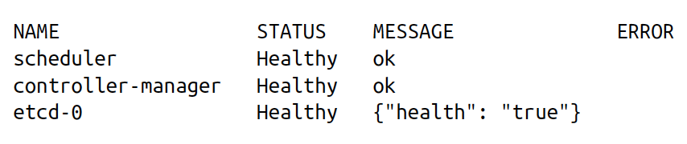

# Chapter 3. Deploying a Kubernetes Cluster
This chapter starts off with instructions about how to get up and running with a Kubernetes cluster on Azure, GCP and AWS. In case you don’t want to pay for a cloud provider, you can use minikube locally. I’m not that in detail here.

# The Kubernetes Client
We interact with the k8s API using a command-line tool called `kubectl`. It can be used to:
- check and explore the health of the cluster
- interact with various k8s objects like services, pods, etc.

## Checking Cluster Status
We can do a basic health check for our cluster using the following command:
`$ kubectl get componentstatuses`

The output should look like this:

Let’s explore the various components:
- the scheduler: place different pods into different nodes
- controller-manager: running the controllers coordinating the cluster (e.g. making sure all replicas are running and heathy)
- etcd: it’s the storage where the cluster state (API objects and related info) is stored

## Listing Kubernetes Worker Nodes
`$ kubectl get nodes`

This lists all the nodes in the cluster.  The nodes are of two kinds:
- master: the components that are required to run the cluster are present on this node. For example, containers containing the API server, scheduler, etc. Work is usually not scheduled on this node to make sure the functioning of the cluster isn’ t interrupted
- worker: where user containers are run

# Cluster Components
- The components that make k8s are run using and deployed on k8s itself
- they run in the `kube-system` namespace

## Kubernetes Proxy
- routes network traffic to services using a load balance in the cluster
- every node has a proxy to accomplish this using `DaemonSet` (covered later in the book)

## Kubernetes DNS
- provides DNS services (naming and discovery) for services (logical grouping of pods)  in the cluster
- runs as a replicated service
- run as a k8s deployment (an object?) which manages the replicas
- a k8s service performs load balancing for this DNS service

## Kubernetes UI
- run as a single replica
- managed by a k8s deployment 
- uses a service for load balancing 
