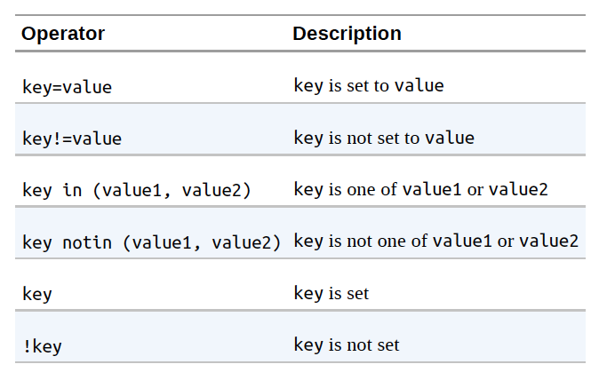

# Chapter 6: Labels and Annotations
* mark and organise resources to group them
* map them to how you think about them

# Labels
* key-value pairs attached to k8s objects
* identifying metadata for objects
* used for grouping, viewing, operating

### Syntax:
label keys: [dns sub-domain]/name
label values is a string not exceeding 63 chars.

## Label Selectors
* filter objects based on labels
* `kubectl --selector` option accomplishes this
* based on boolean math

# Annotations
* additional metadata for k8s objects
* other programs that interact with k8s via an API can store info about objects such as where it came from, policy, etc.

## Defining Annotations
* keys have the same format as label keys
* value is a free-form string, no data validation is performed
* defined in the `metadata` section of the YAML file of the object